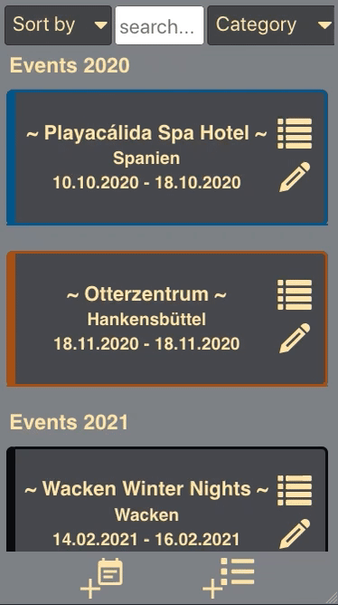
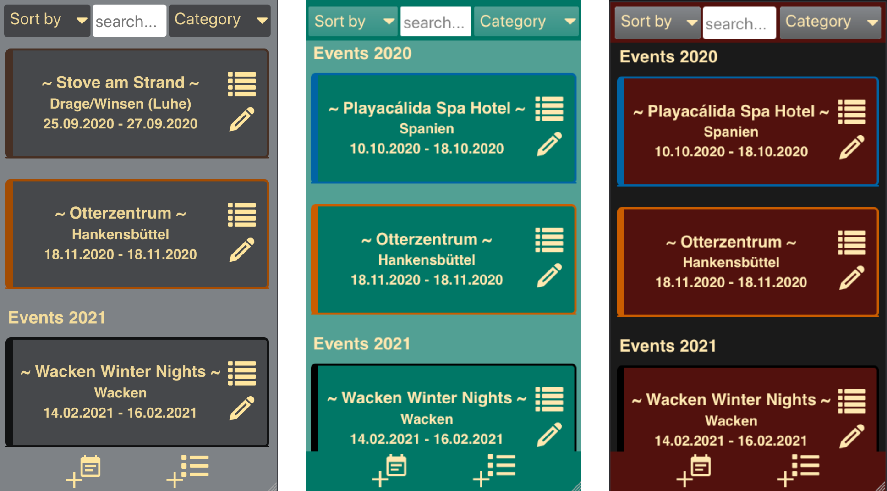
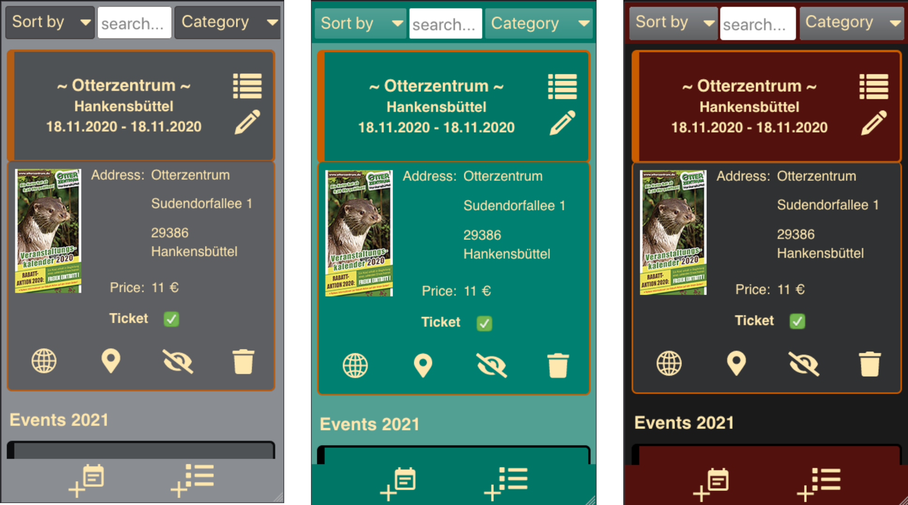
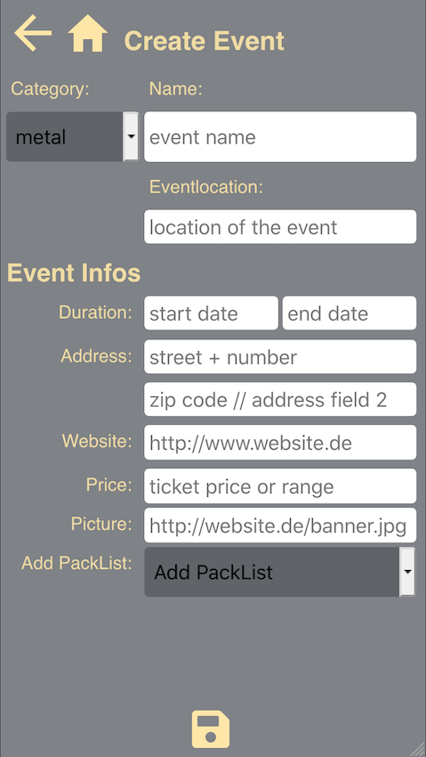
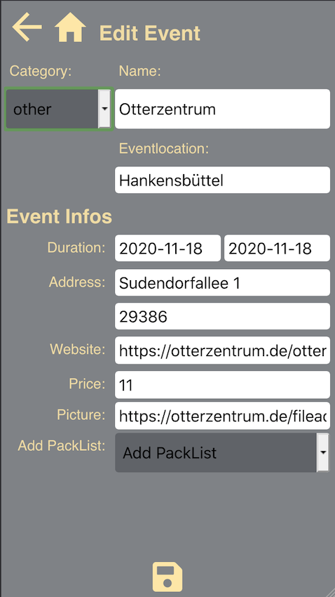
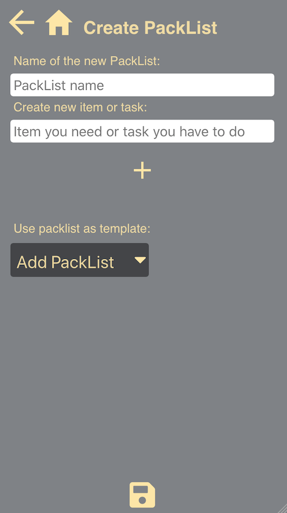
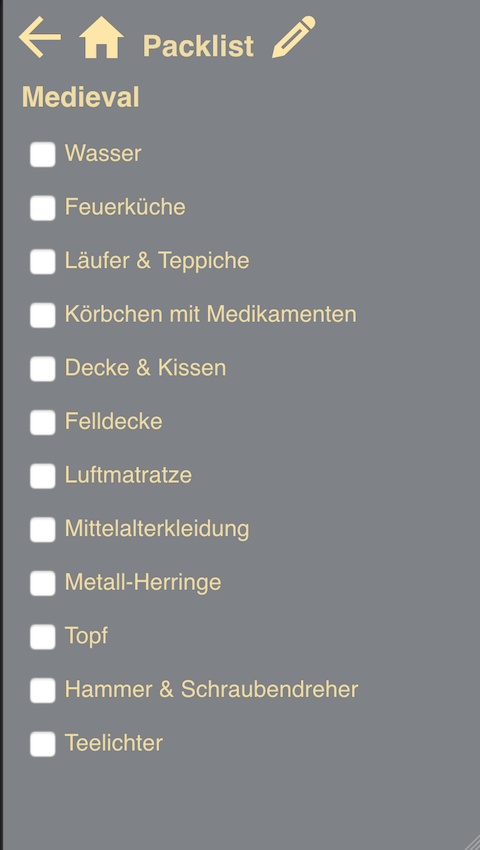

# EventView

EventView gives the possibility to organise events clearly through categories and different sort options. For each event it is possible to add an individual packlist or chose one from a template. It was made with the Create React App and useHookForms.

This app was developed as my capstone project during the final four weeks of the neuefische Web Development Bootcamp in September, 2020 in Hamburg, Germany.

EventView is optimizes for mobile usage,so please switch your browser to responsive mode (iPhone 6/7/8).

Click [here](https://event-planner.jennydely.vercel.app/) to take a look at the app or watch the preview below.

EventView is still in progress and will be including some more options soon, like an login function or an "Add to own calender" possibility. If you have some wishes or ideas, feel free to contact me.

# App Videos
    

# Screenshots
There are different designs avaiable:

 

Some more examples from the Design 1:

                                     

                                    

# Tech stack

- React
- React Hooks
- React HookForms
- React Router
- React Spring
- styled-components
- prop-types
- localStorage
- uuid
- Storybook
- Jest
- React Testing Library
- Cypress
